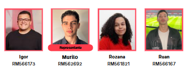

# Click Predict

Este projeto foi desenvolvido por alunos do curso Tecnólogo em Ciências de Dados da Faculdade de Informática e Administração Paulista (FIAP) como parte das atividades acadêmicas. O objetivo é demonstrar o protótipo de um dashboard para a predição de tickets de passagens utilizando dados históricos.

O dashboard foi construído com o _Streamlit_ e utiliza técnicas de análise de dados e predição para fornecer _insights_ sobre vendas de passagens rodoviárias pela _ClickBus_.

O projeto inclui a análise de dados históricos de vendas de passagens, permitindo _insights_ sobre o comportamento dos clientes e previsões de demanda futura.

**Empresa parceira:** _ClickBus_

**Desenvolvedores:** Igor Cardoso, Murilo Jucá, Rozana Malta e Ruan Garcia.

**Tutor da turma:** Prof. Dr. Leandro Romualdo da Silva



## Configuração do Ambiente Virtual (venv)

Crie e ative um ambiente virtual para isolar as dependências do projeto.

### Linux / macOS (bash/zsh)

```bash
python3 -m venv .venv
source .venv/bin/activate
python -m pip install --upgrade pip
```

### Windows (PowerShell)

```powershell
py -m venv .venv
.\.venv\Scripts\Activate.ps1
python -m pip install --upgrade pip
```

**Para desativar o ambiente virtual:**

```bash
deactivate
```

---

## Instalação de Dependências

O repositório inclui um arquivo `requirements.txt`. Com o ambiente virtual ativado, rode:

```bash
pip install -r requirements.txt
```

---

## Como executar o Streamlit

Para iniciar a aplicação Streamlit, execute o comando abaixo no terminal, dentro da pasta do projeto:

```bash
streamlit app_1.py
```

---

## Dica

Quando adicionar ou remover bibliotecas, atualize o arquivo:

```bash
pip freeze > requirements.txt
```
