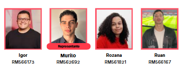

# Click Predict

O _Click Predict_ é uma solução de inteligência preditiva desenvolvida para a ClickBus, com o objetivo de transformar dados históricos de compras em previsões acionáveis. Utilizando técnicas de ciência de dados e modelos como Random Forest Classifier, LightGBM e FP-Growth otimizado, o sistema prevê quais clientes têm maior probabilidade de realizar uma nova compra e quais rotas são mais prováveis.

A solução conta com um dashboard interativo em tempo real, que permite segmentar clientes, visualizar previsões e extrair listas prontas para campanhas personalizadas. Com isso, a ClickBus pode aumentar a retenção de clientes, reduzir a fragmentação da jornada, suavizar a sazonalidade e potencializar a receita incremental por meio de estratégias mais assertivas de marketing, vendas e planejamento.

**Empresa parceira:** _ClickBus_

**Desenvolvedores:** Igor Cardoso, Murilo Jucá, Rozana Malta e Ruan Garcia.

**Tutor da turma:** Prof. Dr. Leandro Romualdo da Silva



## Configuração do Ambiente Virtual (venv)

Crie e ative um ambiente virtual para isolar as dependências do projeto.

### Linux / macOS (bash/zsh)

```bash
python3 -m venv .venv
source .venv/bin/activate
python -m pip install --upgrade pip
```

### Windows (PowerShell)

```powershell
py -m venv .venv
.\.venv\Scripts\Activate.ps1
python -m pip install --upgrade pip
```

**Para desativar o ambiente virtual:**

```bash
deactivate
```

---

## Instalação de Dependências

O repositório inclui um arquivo `requirements.txt`. Com o ambiente virtual ativado, rode:

```bash
pip install -r requirements.txt
```

---

## Como executar o Streamlit

Para iniciar a aplicação Streamlit, execute o comando abaixo no terminal, dentro da pasta do projeto:

```bash
streamlit run streamlit_app.py
```

---

## Dica

Quando adicionar ou remover bibliotecas, atualize o arquivo:

```bash
pip freeze > requirements.txt
```

## MVP - Click Predict
Acesse o link: [https://clickpredict-wearehumanosandnotrobots.streamlit.app/]